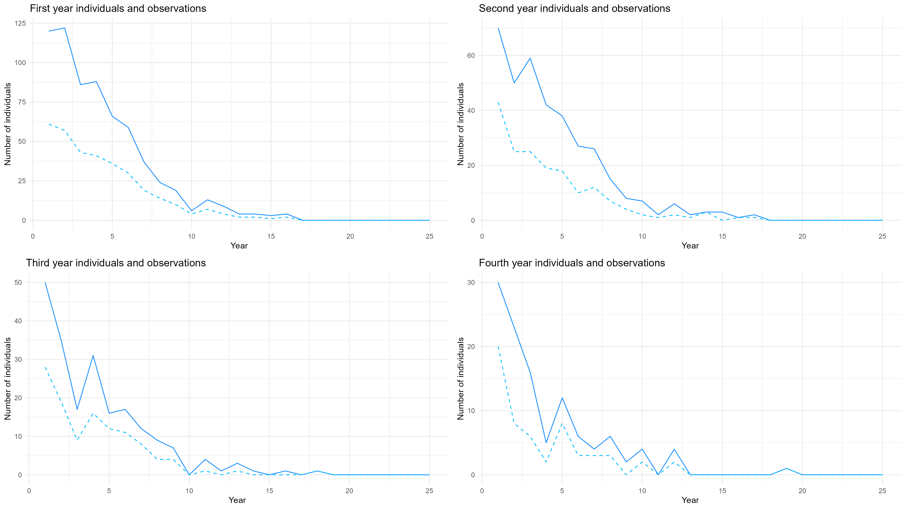
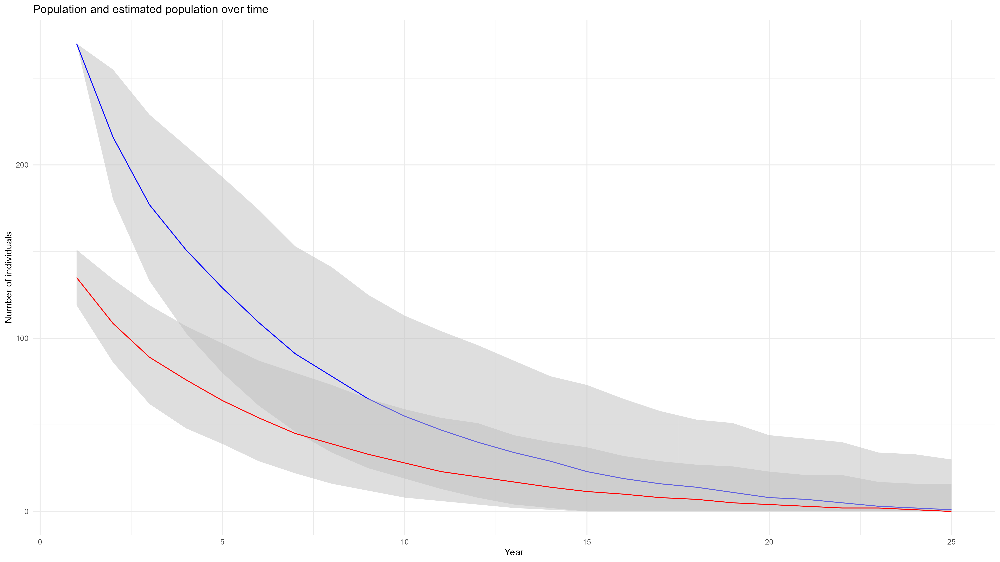

```{r setup, include=FALSE}
library(tidyverse)
library(broom)
library(knitr)
library(ggplot2)
library(gridExtra)
library(statsecol)
library(scales) #all the packages I will be using in this analysis
knitr::opts_chunk$set(echo = FALSE)
```

Here is a very basic skeleton guide to give a sense of what I expect from the assignment. Hopefully this helps. Not sure how much rmarkdown you have been exposed to, but in case you wanted to (learn to) use it, here you go. This pdf is generated from the code I sent, but changing the output in the first few lines to html_document will produce an html file. You can submit pdf, html, or word to moodle and you definitely don't have to use markdown (although it allows you to embed code and therefore avoids having to submit multiple files). Please ask if you aren't sure.

Okay, below would be a perfectly acceptable way to approach the assignment. I like emphasizing the importance of sharing and annotating code. So I hope this is a practice you can adopt. It won't affect your grade, but I do need to be able to follow along so I can see what you did if things dont quite look right. 

Equations may be the challenging part. To write an in-line equation or mathematical symbol, you us single dollar signs ($\sigma$) and an equation on its own line requires double dollar signs:


# Question 1

## For continuity and simplicity, I will answer questions a. and b. together, discussing each stage of the dynamics and how these are implemented in R before combining them into a script for the whole model.

First in the BAS model is survival, which can be modelled using a binomial distribution, as there are only two outcomes (survival or death) and the probability is fixed within each age class. A function to implement this takes a population vector and a vector of survival probabilities for each class, phi. 

$$ $$

```{r, eval=FALSE}
survival <- function(pop, phi){
    newpop <- rep(0, length(pop))
    for (i in 1:length(pop)){
        newpop[i] <- rbinom(1, pop[i], phi)
    }
    return(newpop)
}
```

Next comes ageing, which is a deterministic process (all animals age each year) so needs no stochastic component. This process could have been included within the survival code, but for clarity we define it as below, moving each animal forward one age class. 

```{r, eval=FALSE}
ageing <- function(pop){
    newpop <- rep(0, length(pop))
    for (i in 1:(length(pop)-1)){
        newpop[i+1] <- pop[i]
    }
    return(newpop)
}
```

Lastly in the model comes reproduction. As animals in years 2 and 3 give birth to a discrete number of individuals at a rate with constant mean, the poisson distribution is appropriate to use for reproduction. This can be implemented by summing the poisson additions from all adults. You could also generate a single observation from a single combined poisson variable, but I find this the most intuitive way to formulate the code.

$$ $$

```{r, eval=FALSE}
reproduction <- function(pop, rho){
    births <- 0
    for (i in 1:length(pop)){
        births <- births + rpois(1, pop[i]*rho[i])
    }
    pop[1] <- births
    return(pop)
}
```

Finally, once the underlying dynamics have been implemented, we have to add a final stochastic component - detection. There is no double counting and each individual has a fixed probability of being detected or not detected so detection can be implemented using a binomial distribution, in a very similar way to survival earlier.

$$ $$

```{r, eval=FALSE}
detection <- function(pop, p){
    detected <- rep(0, length(pop))
    for (i in 1:length(pop)){
        detected[i] <- rbinom(1, pop[i], p)
    }
    return(detected)
}
```

Now we have defined each component of the model, we can very easily combine them to simulate the dynamics over a number of years, as seen below.

```{r, eval=FALSE}
# putting it all together to observe dynamics
model <- function(N0, phi, rho, p, nyears=25){
    # initialise matrix with n0 and an observation of n0
    pop <- matrix(, nrow=nyears, ncol=length(N0))
    obs <- matrix(, nrow=nyears, ncol=length(N0))
    pop[1,] <- N0
    obs[1,] <- detection(pop[1,], p)

    # simulate forward for year 2+
    for (i in 2:nyears){
        # feeds the population vector through sub-processes
        pop[i,] <- pop[i-1,] |> survival(phi) |> ageing() |> reproduction(rho)

        # generate detected observation
        obs[i,] <- pop[i,] |> detection(p)
    }

    # return results as data frame - more convenient for plotting
    dat <- data.frame(
        year = 1:nyears,
        pop_1 = pop[,1], pop_2 = pop[,2], pop_3 = pop[,3], pop_4 = pop[,4],
        pop_total = rowSums(pop),
        obs_1 = obs[,1], obs_2 = obs[,2], obs_3 = obs[,3], obs_4 = obs[,4],
        obs_total = rowSums(obs)
    )
    return(dat)
}
```

Here we see the huge advantage to this functional approach to the model, as all the subprocesses can be easily applied when simulating forward. This creates a model that could be applied to a variety of similar population dynamics (though the dataframe outputted would have to be adapted to include more age classes). 

To specify our population dynamics and simulate the true and detected populations, we simply need to define the starting population N0; the survival and reproduction rates for each age and the constant detection rate. This is done below to allow the model to be simulated. 

```{r, eval=FALSE}
# parameters as given in the project
n0 <- c(120, 70, 50, 30) # initial population
phi <- c(0.45, 0.7, 0.7, 0.0) # survival rates
rho <- c(0.0, 0.9, 1.9, 0.0) # reproductive rates
p <- 0.5 # detection probability

# simulating one instance of the dynamics
sim <- model(n0, phi, rho, p)
```

## Simulate and plot 25 years of age-specific population dynamics and observations and produce an informative visualisation of the data.

Firstly we simulate a single set of population dynamics, and can see an example of how the dynamics look in each stage. There is a clear decline due to low survival rates and insufficient birth rates to support the population, but we do see some slight periodicity in the decline which is to be expected in a stochastic model where and overperformance in births one year (e.g. the first year) will lead to a stronger population for the coming years afterward (the spike in the graph below that appears in first year individuals in year 2, second years in year 3, etc. )

The solid blue line represents the true population and the observations are given by the dotted line.



To get a better sense of what we can expect the population to look like I have also plotted the upper quartile, lower quartile and median of the yearly total population in 1000 simulations. The population still tends to die out, but I found myself impressed by the fact that in 25% of cases the population still had 30+ members afte 25 years. Also, it speaks to the nature of stochastic dynamics that both the true and observed populations have huge variability from one simulation to the next. 



# Question 2

## a. Rewriting the model for the case where removal occurs before growth.

$N_t = (N_{t-1} - c_{t-1}) + r_t * (N_{t-1} - c_{t-1}) * [1 - (N_{t-1} - c_{t-1})/K_t]$

```{r}
library(ggplot2)
```

```{r}
# parameter setting
alpha_0 <- 0.1  # Growth rate model
alpha_1 <- 0.05 
beta_0 <- 5     # Carrying Capacity
beta_1 <- 0.1   

# initial population size and year
N0 <- 100
years <- 25

# rainfall
set.seed(42)
R <- runif(years, min = 0, max = 1.5) 

# removal
c <- rep(10, years - 1) 

# model 1: removal after growth
N_removal_after_growth <- function(years, N0, R, alpha_0, alpha_1, beta_0, beta_1, c) {
  N <- numeric(years)
  N[1] <- N0
  
  for (t in 2:years) {
    rt <- exp(alpha_0 + alpha_1 * R[t])
    Kt <- exp(beta_0 + beta_1 * R[t])
    
    N[t] <- (N[t-1] + rt * N[t-1] * (1 - N[t-1] / Kt)) - c[t-1]
    N[t] <- max(N[t], 0) # keep positive
  }
  
  return(N)
}

# model 2: removal before growth
N_removal_before_growth <- function(years, N0, R, alpha_0, alpha_1, beta_0, beta_1, c) {
  N <- numeric(years)
  N[1] <- N0
  
  for (t in 2:years) {
    rt <- exp(alpha_0 + alpha_1 * R[t])
    Kt <- exp(beta_0 + beta_1 * R[t])
    N[t] <- (N[t-1] - c[t-1]) + rt * (N[t-1] - c[t-1]) * (1 - (N[t-1] - c[t-1]) / Kt)
    N[t] <- max(N[t], 0) # keep positive
  }
  
  return(N)
}

# simulate two situations
Nt_removal_after_growth <- N_removal_after_growth(years, N0, R, alpha_0, alpha_1, beta_0, beta_1, c)
Nt_removal_before_growth <- N_removal_before_growth(years, N0, R, alpha_0, alpha_1, beta_0, beta_1, c)

# observation values
set.seed(42)  
sigma_N <- 6   
Nthat_removal_after_growth <- rnorm(years, mean = Nt_removal_after_growth, sd = sigma_N)
Nthat_removal_before_growth <- rnorm(years, mean = Nt_removal_before_growth, sd = sigma_N)


data <- data.frame(
  Year = rep(1:years, 4),  
  Population = c(Nt_removal_after_growth, Nt_removal_before_growth, Nthat_removal_after_growth, Nthat_removal_before_growth),
  Model = rep(c("Removal After Growth", "Removal Before Growth", 
                "Observed Removal After Growth", "Observed Removal Before Growth"), 
              each = years)
)
```


```{r}
# visulisation
ggplot(data, aes(x = Year, y = Population, color = Model, shape = Model)) +
  geom_line() +
  geom_point(size = 3) +
  labs(title = "Population Dynamics Comparison",
       x = "Years", y = "Population Size") +
  theme_minimal() +
  scale_color_manual(values = c("blue", "red", "green", "orange")) +
  scale_shape_manual(values = c(19, 17, 16, 15)) 
```
## b. Thinking biologically about modelling (r_t) as a function of t or t-1

The amount of rainfall in the previous year may affect the growth of plants, thus providing more food resources for the population in the New Year. Therefore, it may be more reasonable to consider (r_t) as a function of rainfall (R_{t-1}) at time (t-1).\newline

# c. Thinking biologically about modelling (K_t) as a function of t or t-1

Carrying capacity is limited by environmental resources (such as food and water). It may be more realistic to consider (K_t) as a function of rainfall (R_{t-1}) at time (t-1). This means that the rainfall conditions of the previous year determine the environmental carrying capacity of the current year.


# Question 3

```{r model}

rain_rk <- function(pars, years, removals, Nhat, SEhat, rain, model = 1, type = "nll"){
  
  #parameter set up
  N0 <- exp(pars[1])
  N <- numeric(years)
  r <- numeric(years)
  k <- numeric(years)
  N[1] <- N0
  r[1] <- NA
  k[1] <- NA
  
  if(model == 1){ #constant r, k depending on rainfall in previous year
    r[2:years] <- rep(exp(pars[2]),years-1)
    k[2:years] <- exp(pars[3]+pars[4]*rain[1:years-1])
  }
  if(model == 2){ #constant r, k depending on rainfall in current year
    r[2:years] <- rep(exp(pars[2]),years-1)
    k[2:years] <- exp(pars[3]+pars[4]*rain[2:years])
  }
  if(model == 3){ #constant k, r depending on rainfall in current year
    r[2:years] <- exp(pars[2]+pars[3]*rain[2:years])
    k[2:years] <- rep(exp(pars[4]),years-1)
  }
  if(model == 4){ #constant k, r depending on rainfall in previous year
    r[2:years] <- exp(pars[2]+pars[3]*rain[1:years-1])
    k[2:years] <- rep(exp(pars[4]),years-1)
  }
  
  #generate population dynamics:
  for(i in 2:years){
    N[i]=N[i-1] + r[i] * N[i-1] * (1-N[i-1]/k[i]) - removals[i-1]
  }
  
  negloglik <- -sum(dnorm(Nhat,N,SEhat,log=TRUE), na.rm=TRUE)
  
  #what should be returned? 
  if(type=="nll"){  return(negloglik)}
  if(type=="proj"){ return(N)}
}

yrs <- nrow(wildebeest)
rmv <- wildebeest$Catch
Nhat <- wildebeest$Nhat
SEhat <- wildebeest$sehat
rain <- wildebeest$rain

#Optimization of parameters for each model####

fit_1 <- optim(par = c(log(0.1),log(0.25),log(1.5), 0), fn = rain_rk, years = yrs, 
               removals = rmv, Nhat = Nhat, SEhat = SEhat, rain = rain, model=1)

fit_2 <- optim(par = c(log(0.1), log(0.25), log(1.5), 0), fn = rain_rk, years = yrs, 
               removals = rmv, Nhat = Nhat, SEhat = SEhat, rain = rain, model=2)

fit_3 <- optim(par = c(log(0.1),log(0.25), 0, 0), fn = rain_rk, years = yrs, 
               removals = rmv, Nhat = Nhat, SEhat = SEhat, rain = rain, model=3)

fit_4 <- optim(par = c(log(0.1), log(0.25), 0, 0), fn = rain_rk, years = yrs, 
               removals = rmv, Nhat = Nhat, SEhat = SEhat, rain = rain, model=4)

#AIC comparison####

aic1 <- 2*fit_1$value + 2*length(fit_1$par)
aic2 <- 2*fit_2$value + 2*length(fit_2$par)
aic3 <- 2*fit_3$value + 2*length(fit_3$par)
aic4 <- 2*fit_4$value + 2*length(fit_4$par)

#population projection####

proj_1 <- rain_rk(fit_1$par, years = yrs, removals = rmv, Nhat = Nhat, 
                  SEhat = SEhat, rain = rain, model=1, type="proj")
proj_2 <- rain_rk(fit_2$par, years = yrs, removals = rmv, Nhat = Nhat, 
                  SEhat = SEhat, rain = rain, model=2, type="proj")
proj_3 <- rain_rk(fit_3$par, years = yrs, removals = rmv, Nhat = Nhat, 
                  SEhat = SEhat, rain = rain, model=3, type="proj")
proj_4 <- rain_rk(fit_4$par, years = yrs, removals = rmv, Nhat = Nhat, 
                  SEhat = SEhat, rain = rain, model=4, type="proj")

```

## Part 1

a.)	When K is modelled as a function of the current year’s rainfall (scenario 1), the value of Beta 1 is equal to 1.04 whereas when K is modelled as a function of the previous year’s rainfall (scenario 2), this number falls to -0.0286 (See Table \@ref(tab:Beta1table)). In order to find the real effect of Beta 1 on carrying capacity, we have to take it’s exponent. When we do that for scenario 1, we see that for every unit increase in rainfall, carrying capacity by a factor of roughly 2.83. In scenario 2 we see that carrying capacity shrinks by a factor of roughly 0.98 for every unit increase in rainfall. The scale of the effect of rainfall in scenario 2 (that is rainfall from the previous year) appears much reduced compared to scenario 1. In the context of this study, it means that, based on our observations, changes in observed population numbers of wildebeest are not reflected as much in changes in the previous years rainfall compared to the current years rainfall.


```{r beta1 table}
#| label: Beta1table
#| tab.cap: "Beta1 values and values for population models under different scenarios"
#| tab.pos: "H"

#Beta 1 comparisons
Model <- c("K = fn(Rt)","K = fn(Rt-1)")

#beta 1 results table
k_table <- tibble(
  Model = Model,
  beta_1 = c(fit_2$par[4], fit_1$par[4])
)

#Beta 1 outputs for different modelling scenarios####
kable(k_table)

```

b.)	Comparison of AIC values for models generated for the two scenarios show us that modelling carrying capacity as a function of rainfall in the current year appears fits the data better than modelling it as a function of the previous year’s rainfall (Scenario 1 AIC: -19.99; Scenario 2 AIC: -17.08; See Table \@ref(tab:AICtable) for exact values).

## Part 2

a.) When intrinsic growth rate (rt) is modelled as a function of rainfall in the current year alpha 1 roughly equals 0.63 and when it is modelled as a function of rainfall in the previous year it equals 0.16 (See Table \@ref(tab:Alpha1table) for exact values). Unlike carrying capacity, for both scenarios, increases in a 1 unit of rainfall result in increases in intrinsic growth rate. However, under the first modelling scenario, growth rate increases by a factor of 1.88 for every unit increase in rainfall whereas under the second modelling scenario this increase is reduced to a factor of 1.17. As with carrying capacity, we see that when growth rate is modelled as a function of the previous years rainfall, population change is much less sensitive to changes in rainfall.


```{r alpha1 table}
#| label: Alpha1table
#| tab.cap: "Alpha 1 values for population models under different scenarios"
#| tab.pos: "H"

#Beta 1 comparisons
Model2 <- c("r = fn(Rt)","r = fn(Rt-1)")


r_table <- tibble(
  Model = Model2,
  alpha_1 = c(fit_3$par[3], fit_4$par[3])
)

#Alpha 1 outputs for different modelling scenarios####

kable(r_table)

```

b.) AIC values for the two models with variable growth rate show us that the model considering growth rate as a function of rainfall this year fits the data better than the other model. The AIC value for the former model is -18.97 compared to -17.15 for the latter (See \@ref(tab:AICtable) for exact values).

```{r aic table}
#| label: AICtable
#| tab.cap: "AIC values and dAIC values for population models under different scenarios"
#| tab.pos: "H"

#Table of dAIC and AIC values for each model####
aictab <- data.frame(
  Model = c("K = fn(Rt-1)","K = fn(Rt)","r = fn(Rt)","r = fn(Rt-1)"),
  AIC = c(aic1,aic2,aic3,aic4),
  dAIC = c(aic1,aic2,aic3,aic4)-min(c(aic1,aic2,aic3,aic4)))

kable(aictab)
```

## Visualising how the models fit our data

From Figure \@ref(fig:Plots) we can visualise the outputs for alpha a and beta 1 from the respective models. The models that factor r and K in as a function of rainfall in previous years predict populations to have fluctuated much less compared to the models that factor in r and K as a function of rainfall in the same year. This is probably due to the fact that rainfall in the previous year is not correlated as strongly with observed population in our dataset.


```{r plots, fig.width=12, warning = FALSE}
#| label: Plots
#| fig.pos: "H"
#| fig.cap: "Estimated Wildebeest population (millions with 95% CI) from 1960 to 1989. Left: Regression lines from models where carrying capacity is modelled as a function of rainfall from the current year or previous year and intrinsic growth rate is held constant. Right: Regression lines from models where intrinsic growth rate is modelled as a function of rainfall from the current year or previous year and carrying capacity is held constant."

pred_df <- data.frame(years = rep(wildebeest$year,4),
                      N = c(proj_1,proj_2, proj_3, proj_4),
                      Model=rep(aictab$Model,each=nrow(wildebeest)))

#Table of predictions for when r varies by Rainfall
pred_df_r <- pred_df %>%
  filter(Model %in% c("r = fn(Rt)","r = fn(Rt-1)"))

#Table of predictions for when k varies by Rainfall
pred_df_k <- pred_df %>%
  filter(Model %in% c("K = fn(Rt-1)","K = fn(Rt)"))

#plots of changes in abundance in different modelling scenarios####
pred_plot_r <- ggplot(wildebeest, aes(x=year, y=Nhat)) +
  geom_errorbar(aes(ymin=lci,ymax=uci), width=0) +
  geom_point(size=3) +
  geom_line(data=pred_df_r, aes(x=years,y=N,color=Model,group=Model), size = 0.9) +
  ylim(0,2.1) + ylab("Abundance (millions)") + xlab("Year") 

pred_plot_k <- ggplot(wildebeest, aes(x=year, y=Nhat)) +
  geom_errorbar(aes(ymin=lci,ymax=uci), width=0) +
  geom_point(size=3) +
  geom_line(data=pred_df_k, aes(x=years,y=N,color=Model,group=Model), size = 0.9) +
  ylim(0,2.1) + ylab("Abundance (millions)") + xlab("Year") 

grid.arrange(pred_plot_k, pred_plot_r, ncol = 2)

```